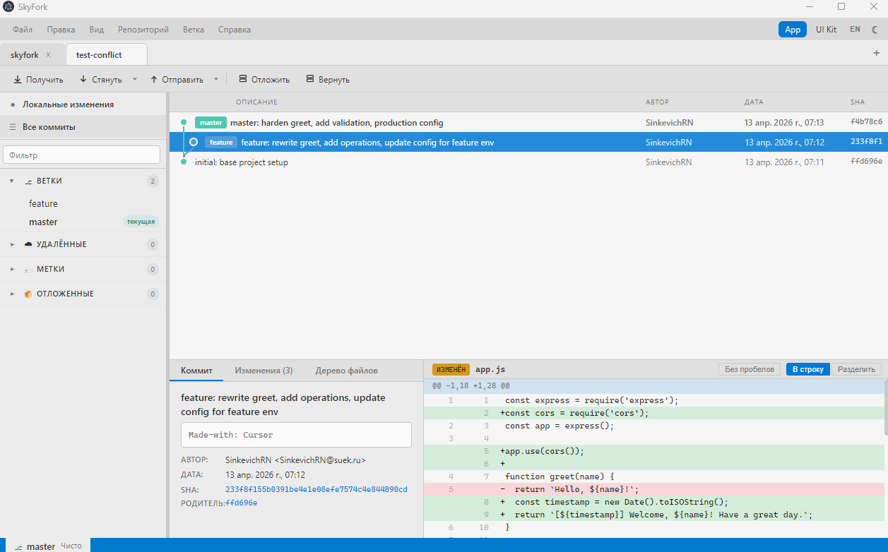

# GitBor

> Русская версия: [docs/ru/](docs/ru/)

Free cross-platform desktop Git client built on Electron. A Fork/GitKraken/SourceTree alternative. Source is MIT-licensed but the repository is not publicly hosted.

Part of the Sky Platform ecosystem.

## Screenshot

Visual overview: commit graph, branch sidebar (Russian UI), and diff viewer.



---

## Quick Start

```bash
cd gitbor
npm install
npm run dev
```

`npm run dev` starts Vite (renderer on port 5188) and Electron (main process) via `concurrently`.

### Build

```bash
npm run build        # Build renderer + main
npm start            # Run the built app
```

### Tests & Lint

```bash
npm test             # Run all tests (Vitest)
npx vitest           # Watch mode
npm run lint         # ESLint check
npm run lint:fix     # ESLint auto-fix
npm run format       # Prettier format
```

### Distribution

```bash
npm run dist:win     # Windows (NSIS + portable)
npm run dist:mac     # macOS (DMG)
npm run dist:linux   # Linux (AppImage + deb)
```

---

## Stack

| Component | Technology |
|-----------|-----------|
| Desktop runtime | Electron 40 |
| UI | React 18, TypeScript 5.9, Vite 6 |
| Styles | CSS Modules, `--sg-*` custom properties |
| File watcher | chokidar 4 |
| Tests | Vitest 4.1 (unit, <!-- TESTS_FILES -->58<!-- /TESTS_FILES --> files / <!-- TESTS_COUNT -->631<!-- /TESTS_COUNT --> tests), Playwright 1.59 (E2E, Windows) |
| DX | husky 9 + lint-staged 17 (pre-commit) + `npm test` (pre-push), `npm run analyze` (rollup-plugin-visualizer) |
| Git | Bundled git binary (`resources/git/{platform}/git`) |

---

## Architecture

4 layers, dependencies flow downward only:

```
┌──────────────────────────────────────────────────────────┐
│  Renderer Process (React)                                │
│  UI: Menu, Sidebar, Graph, Changes, Diff, Merge, SSH    │
├──────────────────────────────────────────────────────────┤
│  Preload Script                                          │
│  contextBridge (secure IPC bridge)                       │
├──────────────────────────────────────────────────────────┤
│  Main Process (Node.js)                                  │
│  Application + Safety + Git Layer + SSH Key Manager      │
├──────────────────────────────────────────────────────────┤
│  Bundled Git                                             │
│  resources/git/{platform}/git                            │
└──────────────────────────────────────────────────────────┘
```

### Data Flow

```
App.tsx → api.invoke() → preload (ipcRenderer) → MessageBridge (ipcMain)
  → CommandHandler → GitExecutor → git binary
```

---

## Project Structure

```
gitbor/
├── src/
│   ├── core/                      # Backend (Main Process)
│   │   ├── bridge/                # IPC bridge
│   │   │   ├── MessageBridge.ts   # Thin (~150 lines) router: cmd → handler from ipc/
│   │   │   ├── messages.ts        # RendererCommand / MainEvent contracts
│   │   │   └── ipc/               # Handler submodules
│   │   │       ├── helpers.ts            # op / opWithPostMerge / runTracked / errOnFail
│   │   │       ├── handlersState.ts      # lifecycle, diff, blame, history
│   │   │       ├── handlersGitOps.ts     # push, pull, fetch, commit, stage, merge, rebase
│   │   │       ├── handlersRepoExtras.ts # LFS, worktrees, hooks, stats, bisect, settings, SSH
│   │   │       └── handlersAi.ts         # AI provider config, generateCommitMessage
│   │   ├── commands/              # Command orchestration
│   │   │   ├── CommandHandler.ts  # Main command dispatcher (per-call services lookup)
│   │   │   ├── ConflictManager.ts # Merge conflicts
│   │   │   ├── readCommands.ts    # Read operations (log, status, branches)
│   │   │   └── writeCommands.ts   # Write operations (commit, push, merge)
│   │   ├── git/                   # Git layer
│   │   │   ├── GitExecutor.ts     # Run git processes (cwd fixed at construction)
│   │   │   ├── GitParser.ts       # Parse git output (large stdout offloaded to WorkerPool)
│   │   │   ├── GitConfig.ts       # Read/write git config (user.name, user.email)
│   │   │   ├── GraphLayout.ts     # Commit graph layout (worker thread when commits > 2000)
│   │   │   ├── DiffParser.ts      # Parse unified diff
│   │   │   ├── ConflictParser.ts  # Parse conflict markers
│   │   │   ├── BlameParser.ts     # Parse git blame
│   │   │   ├── FileHistoryParser.ts # File history
│   │   │   ├── RebaseManager.ts   # Rebase operations
│   │   │   ├── SubmoduleParser.ts # Parse submodules
│   │   │   ├── ReflogParser.ts    # Parse git reflog
│   │   │   ├── BisectManager.ts   # Git bisect: start/good/bad/skip/reset
│   │   │   ├── HooksManager.ts    # Git hooks: list, toggle
│   │   │   ├── WorktreeManager.ts # Git worktrees: list, add, remove
│   │   │   ├── LfsManager.ts      # Git LFS: status, track, untrack
│   │   │   └── types/             # Types: Commit, Branch, Tag, GraphNode, etc.
│   │   ├── ai/                    # AI module (commit message generation)
│   │   │   ├── AiService.ts       # Facade: ensureProvider + generateCommitMessage
│   │   │   ├── AiHandlers.ts      # Per-requestId AbortController, mask secrets
│   │   │   ├── AiConfigStore.ts   # Persistent config in {userData}/ai-config.json
│   │   │   ├── prompts.ts         # buildCommitSystemPrompt (auto/en/ru), MAX_DIFF_CHARS
│   │   │   ├── qwenWebModels.ts   # Whitelist of qwen3-* model ids
│   │   │   ├── types.ts           # AiProviderConfig, AiCompletionResult, AiError
│   │   │   └── providers/
│   │   │       ├── base.ts                 # AiProvider interface
│   │   │       ├── OpenAiCompatibleProvider.ts # /v1/chat/completions + SSE
│   │   │       └── QwenWebProvider.ts          # chat.qwen.ai via session token
│   │   ├── ssh/                   # SSH key management
│   │   │   └── SshKeyManager.ts   # List, generate, delete SSH keys
│   │   ├── safety/                # Data protection layer
│   │   │   ├── OperationQueue.ts  # Per-repo: reads parallel, writes serial
│   │   │   ├── OperationJournal.ts # WAL operation journal
│   │   │   ├── SafetyNet.ts       # Auto-stash + rollback
│   │   │   ├── AtomicWrite.ts     # Atomic writes (tmp+rename+fsync, Windows retry via Atomics.wait)
│   │   │   └── RecoveryManager.ts # Startup checks (locks, journal, rebase)
│   │   ├── services/
│   │   │   └── RepoServicesRegistry.ts # Map<repoPath, {git, queue, safety}> + bootstrap
│   │   ├── state/
│   │   │   ├── StateManager.ts        # Facade over the 3 layers below
│   │   │   ├── RepoSlicesStore.ts     # slicesByRepo Map + meta + mirror
│   │   │   ├── RepoStateRefresher.ts  # All async refresh* + cold phase
│   │   │   ├── RepoEventBus.ts        # state / switch / close subscription channels
│   │   │   ├── repoSlice.ts           # RepoSlice type, GIT_*_FORMAT, hashGitStdout
│   │   │   ├── FileWatcher.ts         # Per-repo chokidar (debounce: .git 50ms, worktree 200ms)
│   │   │   ├── GraphCache.ts          # Cached graph layouts per repo
│   │   │   └── AuthorStatsCache.ts    # Cached per-author code stats
│   │   ├── workers/
│   │   │   ├── WorkerPool.ts      # 2 workers, round-robin, auto-respawn
│   │   │   └── parserWorker.ts    # parseStatus / parseCommits / computeGraphLayout
│   │   ├── activity/
│   │   │   ├── gitActivityStore.ts # Journal of git operations (per-repo, cap 100)
│   │   │   └── activityContext.ts  # AsyncLocalStorage to attribute exec → operation
│   │   └── utils/
│   │       ├── Logger.ts          # Singleton mainLogger (silent in prod, debug in dev)
│   │       ├── AppError.ts        # Structured error: code + data for renderer-side i18n
│   │       ├── pathSecurity.ts    # safePath (traversal + symlink), isSafeFilename
│   │       └── repoPathGuard.ts   # isDangerousRepoRoot (home, drive root, Windows...)
│   │
│   ├── main/                      # Electron entry point
│   │   └── main.ts                # Window creation, service init, no native menu
│   │
│   ├── preload/
│   │   └── index.ts               # contextBridge.exposeInMainWorld('gitBorAPI')
│   │
│   └── renderer/                  # Frontend (React)
│       ├── src/
│       │   ├── App.tsx            # Root component (composition only)
│       │   ├── AppDialogs.tsx     # All modal dialogs in one place
│       │   ├── api.ts             # gitBorAPI wrapper (invoke, onEvent)
│       │   ├── features/          # Feature modules
│       │   │   ├── graph/         # Commit graph (virtualized)
│       │   │   ├── sidebar/       # Sidebar (branches, tags, stash, remotes)
│       │   │   ├── changes/       # Changed files (tree + fileTreeModel.ts), CommitBar
│       │   │   ├── diff/          # Diff viewer (inline + split, ignore whitespace)
│       │   │   ├── merge/         # Merge conflict resolution (ConflictPanel, MergeEditor)
│       │   │   ├── toolbar/       # Toolbar actions
│       │   │   ├── blame/         # Git blame
│       │   │   ├── file-history/  # File history
│       │   │   ├── rebase/        # Interactive rebase editor
│       │   │   ├── repo-manager/  # Repository management
│       │   │   ├── repo-tabs/     # Multi-repo tabs (+ tab opens RepoManager)
│       │   │   ├── titlebar/      # Custom menu bar (replaces native Electron menu)
│       │   │   ├── layout/        # CommitsView, ChangesView, RightPanelContent
│       │   │   ├── ssh/           # SSH Keys Manager dialog
│       │   │   ├── settings/      # Repository Settings dialog
│       │   │   ├── ai/            # AI: AiSettingsDialog, AiGenerateButton, presets, useAiConfig
│       │   │   ├── reflog/        # Git Reflog viewer
│       │   │   ├── bisect/        # Git Bisect UI
│       │   │   ├── hooks/         # Git Hooks manager
│       │   │   ├── worktrees/     # Git Worktrees manager
│       │   │   ├── lfs/           # Git LFS manager
│       │   │   └── gitignore/     # .gitignore editor
│       │   ├── ui/                # UI kit (SgButton, SgDialog, SgToast, SgPromptDialog, MenuBar...)
│       │   ├── hooks/             # React hooks
│       │   │   ├── useAppState.ts          # Facade over the 3 hooks below
│       │   │   ├── useRepoSlices.ts        # slices Map + meta
│       │   │   ├── useRunningOps.ts        # Per-repo running ops + lastOpResult
│       │   │   ├── useStateSubscription.ts # Single onMainEvent listener + dispatcher
│       │   │   ├── useMenuActions.ts       # Menu/keyboard action dispatcher
│       │   │   ├── useKeyboardShortcuts.ts # Maps shortcuts to menu actions
│       │   │   ├── useOperationToasts.ts   # Toast on op result
│       │   │   ├── useDiffState.ts         # Current diff target
│       │   │   ├── useTheme.ts             # Dark/light + localStorage
│       │   │   ├── useToasts.ts            # Toast queue
│       │   │   ├── useContextMenu.ts       # Context menu state
│       │   │   ├── useDialogs.ts           # Centralized dialog visibility
│       │   │   └── useAutoFetch.ts         # Background fetch
│       │   ├── i18n/              # UI localization (ru, en)
│       │   ├── styles/            # Global styles, CSS variables, themes
│       │   ├── types/             # TypeScript types for renderer
│       │   └── pages/
│       │       └── showcase/      # UI Showcase (component demos)
│       ├── package.json
│       └── vite.config.ts
│
├── tests/                         # Unit tests (Vitest, <!-- TESTS_COUNT -->631<!-- /TESTS_COUNT --> tests in <!-- TESTS_FILES -->58<!-- /TESTS_FILES --> files)
│   ├── git/                       # Parsers, managers
│   ├── commands/                  # writeCommands (incl. batch discardFiles), readCommands, ConflictManager
│   ├── state/                     # StateManager (multi-repo), repoSlice
│   ├── services/                  # RepoServicesRegistry (lifecycle, isolation)
│   ├── activity/                  # GitActivityStore
│   ├── safety/                    # OperationQueue, AtomicWrite, OperationJournal, RecoveryManager, LongPathSuggester
│   ├── bridge/                    # IPC contracts, ipc/helpers, MessageBridge.handleCommand, handlersGitOps
│   ├── ai/                        # AiConfigStore, AiHandlers, AiService, providers (OpenAI/QwenWeb), prompts, presets
│   ├── changes/                   # fileTree (buildFileTree, collectFiles)
│   ├── repo-manager/              # recentRepos (invalid path filtering)
│   ├── main/                      # gracefulShutdown
│   ├── utils/                     # pathSecurity, repoPathGuard, AppError, Logger
│   └── i18n/                      # Localization completeness, tpl
│
├── tests-e2e/                     # Playwright E2E (Windows-only, 3 specs)
│   ├── helpers.ts                 # launchApp(), makeFixtureRepo()
│   ├── app-launch.spec.ts         # Smoke: titlebar visible
│   ├── open-repo.spec.ts          # autoOpenRepo via cwd=fixture
│   └── switch-tab.spec.ts         # Multi-repo tab switching
│
├── docs/                          # Documentation
│   ├── getting-started.md         # Setup and dev workflow
│   ├── architecture.md            # Architecture overview
│   ├── features.md                # Feature list
│   ├── contributing.md            # Contributing guide
│   ├── testing.md                 # Testing (Vitest + Playwright)
│   ├── cross-platform-checklist.md # Cross-platform audit
│   ├── audit/                     # Per-stream audit reports + bundle analyzer output
│   └── ru/                        # Russian translations
│
├── .github/workflows/             # ci.yml (push, 3 OS, Node 20) + pr.yml (PR, Win, Node 22, +e2e)
├── .husky/pre-commit              # husky 9 + lint-staged 17 + project-wide tsc
├── .husky/pre-push                # npm test (bypass via SKIP_TESTS=1)
├── dist/                          # Build output
├── .gitattributes                 # Line ending normalization
├── vitest.config.ts               # Vitest configuration
├── playwright.config.ts           # Playwright (Windows-only E2E)
├── package.json                   # Electron 40, TypeScript 5.9, Vite 6
└── tsconfig.json
```

---

## Key Features

- **Commit graph** — virtualized scroll, branch coloring, search
- **Branch/Tag/Stash sidebar** — tree view, checkout, merge, rename, delete; current branch marked with green dot
- **Local changes** — tree view, stage/unstage/discard per file and per hunk
- **Folder context menu** — stage / unstage / discard / delete applied to all files inside (Staged/Unstaged sections)
- **Diff viewer** — inline + split, ignore whitespace, stage hunk; no `+`/`−` text prefix in line content (color-only)
- **Merge conflict resolution** — two-column editor, auto-advance, conflict prediction
- **File history & Git blame** — per-file commit history, line-by-line annotations
- **Interactive rebase** — pick/reword/edit/squash/fixup/drop, progress banner
- **Multi-repo tabs** — independent per-repo engines, the `+` tab opens RepoManager; open tabs and the active one are restored on next launch
- **Repository Manager** — recent list, open/clone/init; reachable via the `+` tab or by clicking the active tab again
- **AI commit messages** — one-click generation from staged diff; OpenAI-compatible (OpenAI/Ollama/LM Studio/DeepSeek/Groq) and Qwen Web (chat.qwen.ai session token); commit language `auto`/`en`/`ru`
- **Custom menu bar** — HTML/CSS menu with Edit actions, keyboard shortcuts (no native menu)
- **SSH Keys Manager** — generate, view, copy, delete SSH keys
- **Repository Settings** — user.name/email, global/local toggle
- **Stash dialog** — name field with empty-allowed (empty value = `git stash` without `-m`)
- **Toast notifications** — success/error feedback for all git operations
- **Confirmation dialogs** — destructive actions require confirmation
- **Shell integration** — open in Explorer/Terminal, refresh (F5)
- **Error boundary** — React ErrorBoundary prevents blank screens
- **Git activity log** — per-repo journal of git invocations (start/append/finish, cap 100, stdout/stderr truncated to 16 KiB)
- **Repository statistics** — contributors, code stats with cached author heatmaps
- **Reflog** — HEAD history with restore
- **Git Bisect** — interactive binary search for buggy commits
- **Git Hooks** — view and enable/disable hooks
- **Signed commits** — GPG/SSH verification badges in graph
- **Worktrees** — manage multiple working trees
- **Git LFS** — large file tracking
- **.gitignore editor** — templates for Node, Python, Java, Rust, Go, IDE, OS
- **Compare two commits** — diff between arbitrary commits
- **Arrow key navigation** — ↑/↓ in commit graph
- **i18n** — English and Russian (every UI string covered by `i18n.test.ts`)
- **Themes** — dark and light mode
- **Distribution** — electron-builder for Win/Mac/Linux

---

## Multi-Repo Engine

Each open repository is a fully independent set of services — a long `git pull` on repo A never blocks operations on repo B.

- **`RepoServicesRegistry`** — `Map<repoPath, { git, queue, safety }>`. `acquire(repoPath)` lazily creates services with `cwd` fixed at construction; `release(repoPath)` SIGTERMs only that repo's inflight processes.
- **`StateManager`** = facade over three layers:
  - `RepoSlicesStore` — `slicesByRepo: Map<repoPath, RepoSlice>` + shared `meta` (`openRepos`, `activeRepoIndex`).
  - `RepoStateRefresher` — all async `refresh*` methods, with `isRepoTracked(repoPath)` guard so a background refresh cannot resurrect a just-closed repo.
  - `RepoEventBus` — three subscription channels (state / switch / close).
- **WorkerPool** — 2 `worker_threads`, round-robin, auto-respawn. `parseStatus`/`parseCommits`/`computeGraphLayout` go through workers when input crosses size thresholds (status > 256 KB, log > 512 KB, layout > 2000 commits).
- **Renderer mirror** — `useAppState` is a facade over `useRepoSlices` / `useRunningOps` / `useStateSubscription`. `state.isOperationRunning` and `state.currentOperation` are derived from the active tab only — fetch on A doesn't disable buttons on B.
- **`graphData` deduplication** — `MessageBridge.sentGraphByRepo` skips emitting identical layout payloads, so toggling A→B→A doesn't push megabytes of JSON over IPC.

## AI Module

- **Providers**:
  - `OpenAiCompatibleProvider` — `/v1/chat/completions` with SSE streaming, used by OpenAI, Ollama, LM Studio, DeepSeek, Groq.
  - `QwenWebProvider` — unofficial bridge to `chat.qwen.ai` via session token from `localStorage` (no DashScope API key needed).
- **`AiConfigStore`** — `{userData}/ai-config.json`, atomic write, API key / Qwen token encrypted via Electron `safeStorage` (DPAPI / Keychain / libsecret); fallback to `plain:` prefix when key store is unavailable.
- **`AiHandlers`** — per-`requestId` `AbortController`, `cancelAll()` on shutdown, secret masking (`••••••••`) in `getConfig` for the UI.
- **Prompts** — system + user prompts with commit language `auto`/`en`/`ru`; diff truncated to `MAX_DIFF_CHARS = 6000` (head 70% + tail 20%).
- **UI** — `AiSettingsDialog` (preset `select` with Cloud/Local/Web optgroups + Custom), `AiGenerateButton` in the commit bar, hot path through `useAiConfig`.

## Data Safety

### 5 Levels of Protection

1. **Git reflog** — built-in, 90 days
2. **Auto-stash** — saves uncommitted changes before destructive operations
3. **HEAD hash** — saved for rollback
4. **WAL journal** — `.git/GitBor-journal.json`, begin/complete/fail
5. **RecoveryManager** — startup checks: lock files (stale `.git/index.lock` is ignored on startup), incomplete operations, rebase, merge

### Input Safety

- **Path traversal protection** — `safePath()` validates all IPC paths via `realpathSync.native` (resolves symlinks, case-insensitive on Windows), preventing access outside the repository
- **Dangerous root guard** — `isDangerousRepoRoot()` skips the worktree watcher for home / drive root / `C:\Windows` / `Program Files` / `node_modules` (opening such folders is allowed; only the watcher is suppressed to avoid `EPERM` cascades)
- **Filename validation** — `isSafeFilename()` checks SSH key and git hook names for special characters
- **`AppError`** — structured error with `code` + `data`; `MessageBridge` ships an `error` event with the code, the renderer translates via `locale.repoErrors[code]`
- **Log sanitization** — `sanitizeArgs` redacts commit messages and passphrases after `-m` / `-C` / `-N` / `--message`
- **Shell injection protection** — `openInTerminal` uses `execFile`/`spawn`, never `exec`
- **Safe clipboard** — `copyToClipboard()` wrapper with error handling
- **Electron sandbox** — `contextIsolation: true`, `sandbox: true`, `nodeIntegration: false`
- **Atomic writes** — tmp+rename with fsync, Windows retry via `Atomics.wait` (no busy-spin)

### Cross-Platform

- `.gitattributes` for consistent line endings (LF for source, CRLF for .bat/.cmd)
- Cross-platform paths via `path.join()` / `path.resolve()` throughout the codebase
- Terminal: fallback chain for Linux (gnome-terminal, konsole, xfce4-terminal, xterm)
- `NUL` / `/dev/null` auto-selection per platform

## Logging

Two-sided system: both main and renderer log only in dev mode; production console stays silent.

- **Main** — singleton `mainLogger` with levels `silent`/`error`/`warn`/`info`/`debug`. `configureMainLogger({ isProduction })` in `main.ts` sets default by `app.isPackaged`. `GITBOR_LOG_LEVEL=debug` env var overrides without rebuild.
- **Renderer** — `[GitBor]` prefix; methods are no-ops in Vite production build (`import.meta.env.DEV === false`).
- **`perf.ts`** — separate diagnostic tool with its own opt-in (`GITBOR_PERF=1` / `window.__GITBOR_PERF__ = true`).

---

## Documentation

| Document | Description |
|----------|-------------|
| [Getting Started](docs/getting-started.md) | Prerequisites, setup, dev workflow, adding features |
| [Architecture](docs/architecture.md) | 4-layer design, data flow, core & renderer modules |
| [Features](docs/features.md) | What GitBor can do: graph, diff, merge, blame, etc. |
| [Contributing](docs/contributing.md) | Code style, conventions, PR checklist |
| [Testing](docs/testing.md) | Vitest setup, test structure, manual feature testing |

Russian translations: [`docs/ru/`](docs/ru/)

---

## Status

Version 0.1.0. Backend and UI feature-complete for MVP. <!-- TESTS_COUNT -->631<!-- /TESTS_COUNT --> unit tests across <!-- TESTS_FILES -->58<!-- /TESTS_FILES --> files (Vitest 4.1) plus 3 Playwright E2E specs (Windows). ESLint + Prettier configured; husky 9 + lint-staged 17 enforce `eslint --fix` and project-wide `tsc --noEmit` on each commit; `npm test` runs in `.husky/pre-push` (bypass via `SKIP_TESTS=1`). CI: `ci.yml` runs lint/typecheck/test/build on Ubuntu / Windows / macOS (Node 20) for push events; `pr.yml` runs the same plus E2E on Windows / Node 22 for pull requests. 0 npm audit vulnerabilities (root + renderer). Not production-tested.

## License

MIT
